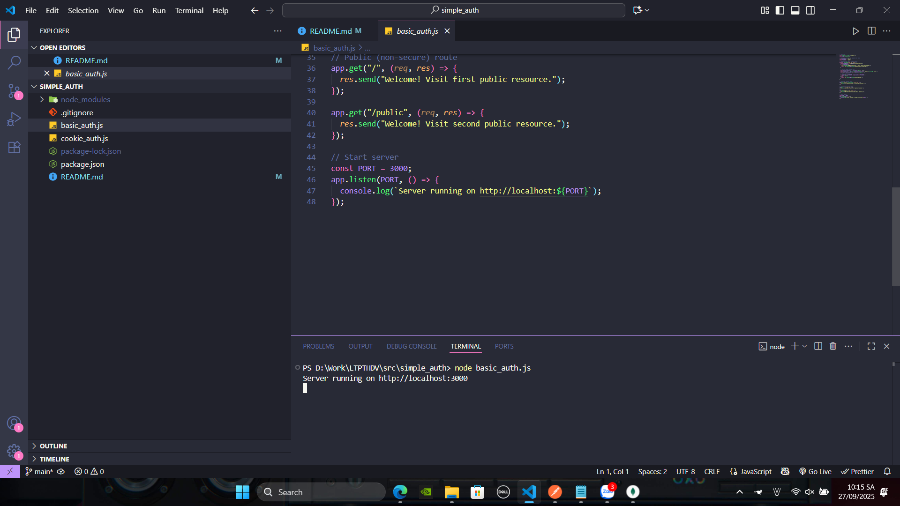
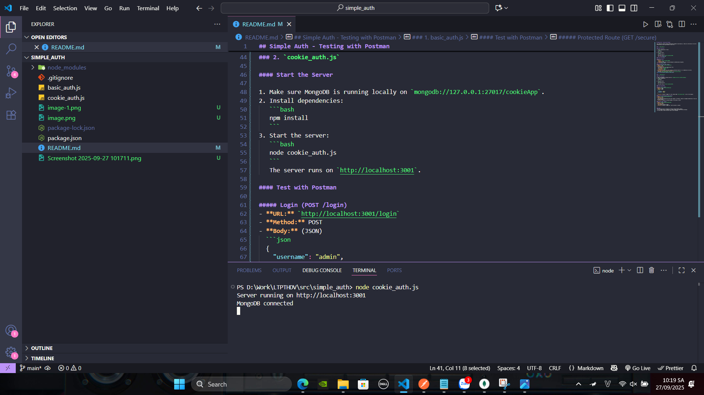
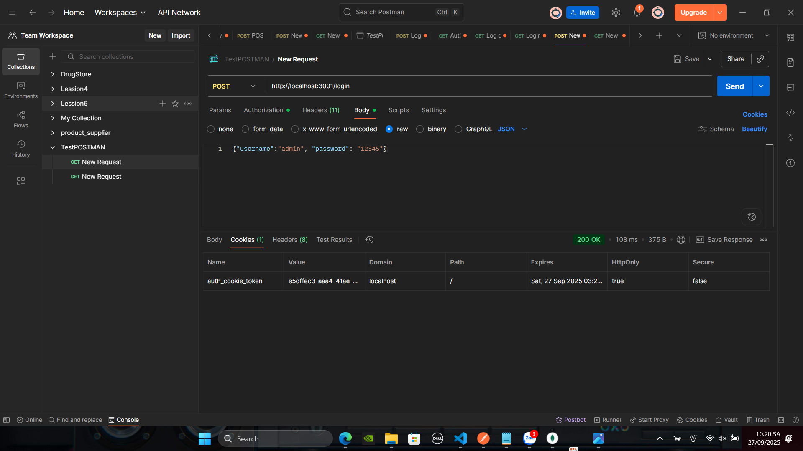
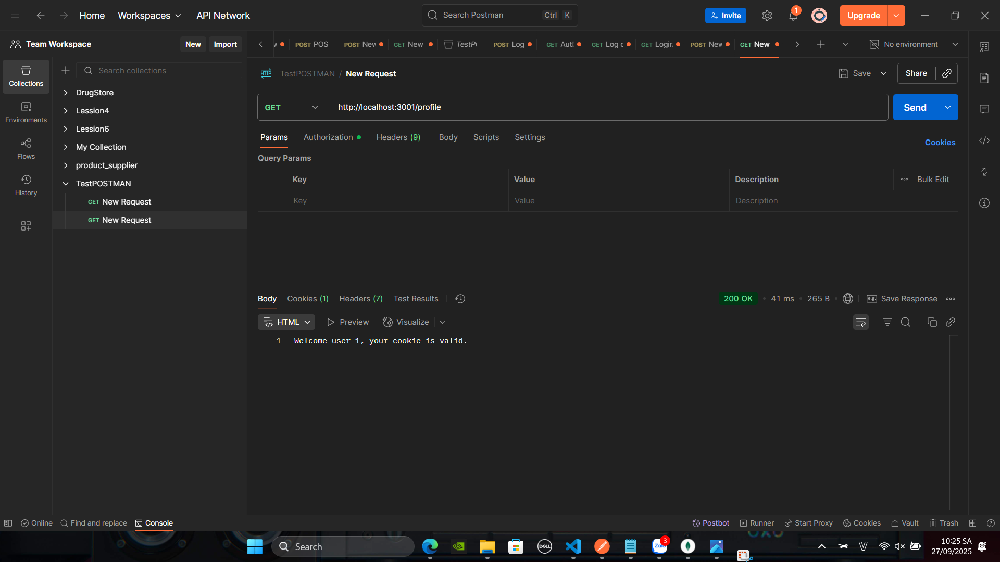
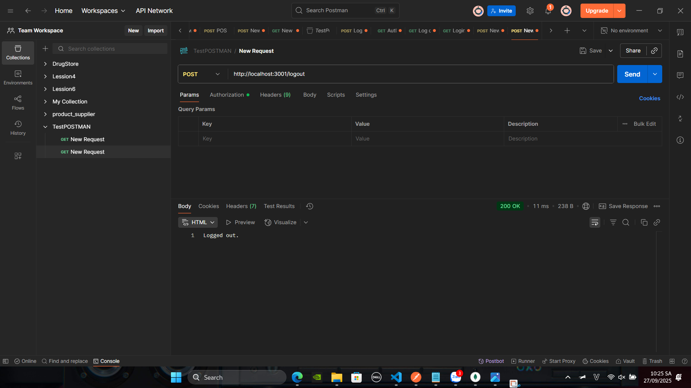
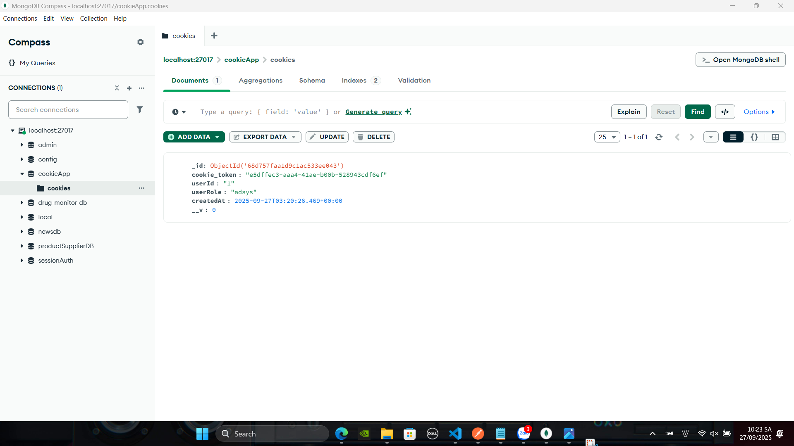

## Simple Auth - Testing with Postman

This repository contains simple authentication examples using Express.js. Below are instructions to test the authentication flows using Postman for each file.


### 1. `basic_auth.js`

#### Start the Server

1. Install dependencies (if any):
   ```bash
   npm install
   ```
2. Start the server:
   ```bash
   node basic_auth.js
   ```
   The server runs on `http://localhost:3000`.
   

#### Test with Postman

##### Public Routes
- **GET /**
  - **URL:** `http://localhost:3000/`
  - **Method:** GET
  - **Expected:** Receives a welcome message (no authentication required).


##### Protected Route (GET /secure)
- **URL:** `http://localhost:3000/secure`
- **Method:** GET
- **Authorization:**
  - In Postman, go to the "Authorization" tab.
  - Set **Type** to `Basic Auth`.
  - **Username:** `admin`
  - **Password:** `12345`
- **Expected:** Receives "You have accessed a protected resource 🎉" if credentials are correct.
- **If credentials are missing or incorrect:**
  - Receives `401 Authentication required.` or `403 Access denied.`

---

### 2. `cookie_auth.js`

#### Start the Server

1. Make sure MongoDB is running locally on `mongodb://127.0.0.1:27017/cookieApp`.
2. Install dependencies:
   ```bash
   npm install
   ```
3. Start the server:
   ```bash
   node cookie_auth.js
   ```
   The server runs on `http://localhost:3001`.

#### Test with Postman

##### Login (POST /login)
- **URL:** `http://localhost:3001/login`
- **Method:** POST
- **Body:** (JSON)
  ```json
  {
    "username": "admin",
    "password": "12345"
  }
  ```
- **Expected:** Receives "Logged in!" and a cookie named `auth_cookie_token` is set in the response.

##### Access Protected Route (GET /profile)
- **URL:** `http://localhost:3001/profile`
- **Method:** GET
- **Pre-requisite:**
  - Use the cookie received from the login response. In Postman, cookies are managed automatically if you use the same session.
- **Expected:** Receives a welcome message if the cookie is valid.

##### Logout (POST /logout)
- **URL:** `http://localhost:3001/logout`
- **Method:** POST
- **Pre-requisite:**
  - Use the same cookie as above.
- **Expected:** Receives "Logged out." and the cookie is cleared.

---

#### Notes
- Use the same session in Postman to preserve cookies between requests.
- If you change the user credentials or schema, update the request body accordingly.
- For any issues, check the server logs for error messages.

